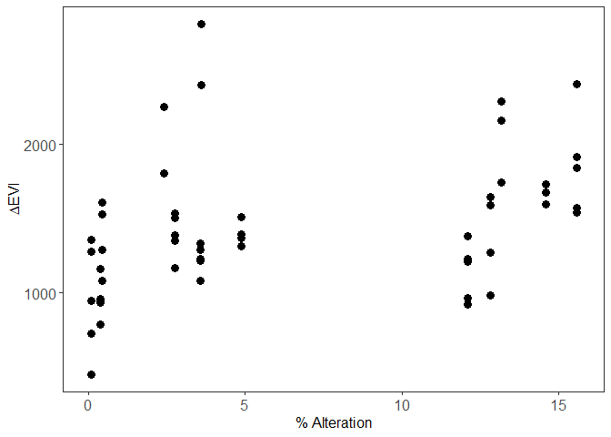

Habitat alteration or climate: What drives the densities of an invading
ungulate?
================
Melanie Dickie
2024-03-26

In this repository you will find the data and scripts used for Dickie et
al.,2024. Habitat alteration or climate: What drives the densities of an
invading ungulate?, Global Change Biology.

# Analysis Details:

We used a two-stage modelling framework to first identify metrics to
best represent the two main variables of interest (habitat alteration
and climate), and then to evaluate their relative effects on average
deer density while controlling for habitat productivity.

``` r
##Join attributes into camera data:
mydata$Year[mydata$monitoring_period  == "monitor_2021"] <-2021
mydata$Year[mydata$monitoring_period  == "monitor_2020"] <-2020
mydata$Year[mydata$monitoring_period  == "monitor_2019"] <-2019
mydata$Year[mydata$monitoring_period  == "monitor_2018"] <-2018
mydata$Year[mydata$monitoring_period  == "monitor_2017"] <-2017
mydata$Year<-as.factor(mydata$Year)
mydata$GridYear<-paste(mydata$grid,mydata$Year,sep="")

mydata$Density<-mydata$density_avg
mydata$LCI<-mydata$density_lci_0.9
mydata$UCI<-mydata$density_uci_0.9

mydata<-mydata%>%
  left_join(Attributes, by="GridYear", suffix=c("",".y"))%>%
  select(-ends_with(".y"))

#rescale all variables from 0 to 1 
scale_values <- function(x){(x-min(x))/(max(x)-min(x))}
mydata$ScaledDirAlt<-scale_values(mydata$Dist)
mydata$ScaledPCADim1<-scale_values(mydata$PCADim1)
mydata$ScaledPCADim2<-scale_values(mydata$PCADim2)
mydata$ScaledMFADim1No2016<-scale_values(mydata$MFADim1No2016)
mydata$ScaledMFADim2No2016<-scale_values(mydata$MFADim2No2016)
mydata$ScaledEvi<-scale_values(mydata$EVI)
mydata$ScaledBufAlt<-scale_values(mydata$AnthroDistPerc)
mydata$ScaledNDep<-scale_values(mydata$n_deployments)

mydata$Year<-as.factor(mydata$Year)
```

# Raw data plots for exploration:

<!-- -->

Figure 1: Deer density as a function of habitat alteration, coloured by
habitat productivity.

<!-- -->

Figure 2: Deer density as a function of weather dimension 1 (annual
winter severity), coloured by habitat productivity.

<!-- -->

Figure 3: Deer density as a function of climate dimension 1 (winter
severity for that region), coloured by habitat productivity.

<!-- -->

Figure 4: Deer density as a function of climate dimension 1 (winter
severity for that region), coloured by habitat alteration.

<!-- -->

Figure 5: Deer density as a function of habitat alteration, coloured by
weather Dimension 1 (annual winter severity).

# Correlation between independent variables of interest:

Disturbance and habitat productivity:
<!-- -->

    ## [1] 0.3717111

Disturbance and weather dimension 1:
<!-- -->

    ## [1] 0.3846461

Disturbance and climate dimension 1:
<!-- -->

    ## [1] -0.5280813

## Model comparisons to choose variables for subsequent analyses:

Because cameras can fail to operate during some monitoring periods, we
include the number of cameras operating in a given cluster year
combination as a model weight (to increase the weight of density
estimates that use more cameras). We also included an ar1 covariance
structure to account for temporal correlation. We specify a tweedie
distribution for all analyses.

``` r
## Direct habitat alteration vs buffered habitat alteration
MS_DirAlt<-glmmTMB(Density~ScaledDirAlt + (1|Year) + (1|grid) + ar1(Year+0 | grid), weights=ScaledNDep, family = tweedie(), data = mydata)
MS_BufAlt<-glmmTMB(Density~ScaledBufAlt + (1|Year) + (1|grid) + ar1(Year+0 | grid), weights=ScaledNDep, family = tweedie(), data = mydata)
AICc(MS_DirAlt, MS_BufAlt)
```

    ##           df       AICc
    ## MS_DirAlt  8 -10.158536
    ## MS_BufAlt  8  -4.537129

Direct alteration (MS_DirAlt) is most supported metric of habitat
alteration.

``` r
## Weather Dimension 1 vs 2 vs both vs climate Dimension 1 vs 2 vs both
MS_PCADim1<-glmmTMB(Density~ScaledPCADim1 + (1|Year) + (1|grid) + ar1(Year+0 | grid), weights=ScaledNDep, family = tweedie(), data = mydata)
MS_PCADim2<-glmmTMB(Density~ScaledPCADim2 + (1|Year) + (1|grid) + ar1(Year+0 | grid), weights=ScaledNDep, family = tweedie(), data = mydata)
MS_PCADims<-glmmTMB(Density~ScaledPCADim1+ScaledPCADim2 + (1|Year) + (1|grid) + ar1(Year+0 | grid), weights=ScaledNDep, family = tweedie(), data = mydata)
MS_MFADim1No2016<-glmmTMB(Density~ScaledMFADim1No2016 + (1|Year) + (1|grid) + ar1(Year+0 | grid), weights=ScaledNDep, family = tweedie(), data = mydata)
MS_MFADim2No2016<-glmmTMB(Density~ScaledMFADim2No2016 + (1|Year) + (1|grid) + ar1(Year+0 | grid), weights=ScaledNDep, family = tweedie(), data = mydata)
MS_MFADims<-glmmTMB(Density~ScaledMFADim1No2016+ScaledMFADim2No2016 + (1|Year) + (1|grid) + ar1(Year+0 | grid), weights=ScaledNDep, family = tweedie(), data = mydata)
AICc(MS_PCADim1, MS_PCADim2, MS_PCADims, MS_MFADim1No2016, MS_MFADim2No2016, MS_MFADims)
```

    ##                  df       AICc
    ## MS_PCADim1        8  -5.291315
    ## MS_PCADim2        8  -2.517887
    ## MS_PCADims        9  -2.653471
    ## MS_MFADim1No2016  8 -11.119059
    ## MS_MFADim2No2016  8  -4.266148
    ## MS_MFADims        9 -12.336650

Climate dimension 1 (MS2_MFADim1No2016) and climate Dimension 1 and 2
(MS2_MFADims) are the most supported metrics of weather or climate,
though Dimension 1 only versus Dimension 1 and 2 are equally supported
(within 2 AIC units). Choose simplest model structure
(MS2_MFADim1No2016).

## Final model

We tested the global model with the winning variables identified above.
Here we are asking “what are the effects of areas that typically
experience more severe winters given habitat productivity, direct
habitat alteration given productivity, and the interaction between areas
that typically experience more severe winters and direct habitat
alteration?”

``` r
MS_Global<-glmmTMB(Density~ScaledEvi*ScaledDirAlt + ScaledEvi*ScaledMFADim1No2016 + ScaledDirAlt*ScaledMFADim1No2016 + (1|Year) + (1|grid) + ar1(Year+0 | grid), weights=ScaledNDep, family = tweedie(), data = mydata)
summary(MS_Global)
```

    ##  Family: tweedie  ( log )
    ## Formula:          
    ## Density ~ ScaledEvi * ScaledDirAlt + ScaledEvi * ScaledMFADim1No2016 +  
    ##     ScaledDirAlt * ScaledMFADim1No2016 + (1 | Year) + (1 | grid) +  
    ##     ar1(Year + 0 | grid)
    ## Data: mydata
    ## Weights: ScaledNDep
    ## 
    ##      AIC      BIC   logLik deviance df.resid 
    ##    -14.8     10.8     20.4    -40.8       40 
    ## 
    ## Random effects:
    ## 
    ## Conditional model:
    ##  Groups Name        Variance  Std.Dev.  Corr      
    ##  Year   (Intercept) 5.725e-02 0.2392734           
    ##  grid   (Intercept) 5.736e-01 0.7573318           
    ##  grid.1 Year2017    7.622e-09 0.0000873 0.98 (ar1)
    ## Number of obs: 53, groups:  Year, 5; grid, 13
    ## 
    ## Dispersion parameter for tweedie family (): 0.137 
    ## 
    ## Conditional model:
    ##                                  Estimate Std. Error z value Pr(>|z|)   
    ## (Intercept)                        1.5624     2.1074   0.741  0.45846   
    ## ScaledEvi                         -2.2407     3.0079  -0.745  0.45630   
    ## ScaledDirAlt                      -0.3279     2.0599  -0.159  0.87351   
    ## ScaledMFADim1No2016               -6.7942     2.5234  -2.692  0.00709 **
    ## ScaledEvi:ScaledDirAlt             0.5531     2.2901   0.242  0.80914   
    ## ScaledEvi:ScaledMFADim1No2016      4.5855     3.8175   1.201  0.22968   
    ## ScaledDirAlt:ScaledMFADim1No2016   3.8706     2.3570   1.642  0.10055   
    ## ---
    ## Signif. codes:  0 '***' 0.001 '**' 0.01 '*' 0.05 '.' 0.1 ' ' 1

    ## Loading required package: ggeffects

<!-- -->

These results suggest that climate is the dominant driver of deer
densities. While habitat alteration and productivity may mediate this
effect, their magnitude is smaller and effects statistically
insignificant.
