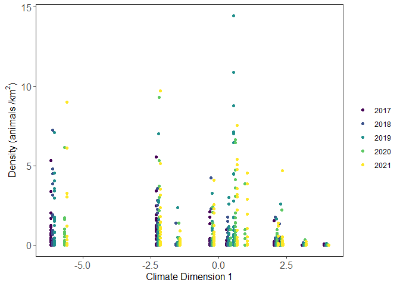

SupplementaryAnalyses
================
Melanie Dickie
2024-03-26

# Check for spatial autocorrelation in the residuals of the top model

``` r
mydata2$resid <- resid(MS_Global)
res <- simulateResiduals(MS_Global)
res2 = recalculateResiduals(res, group = mydata2$grid)
testSpatialAutocorrelation(res2, Grids$x_coord, Grids$y_coord)
```

<!-- -->

    ## 
    ##  DHARMa Moran's I test for distance-based autocorrelation
    ## 
    ## data:  res2
    ## observed = -0.230097, expected = -0.083333, sd = 0.094302, p-value =
    ## 0.1196
    ## alternative hypothesis: Distance-based autocorrelation

Moran’s I test suggests residuals did not exhibit spatial
autocorrelation.

# Appendix A: Seasonal and annual deer densities

``` r
seasonal <- read.csv(here::here("Data", "WTDDensities_BySeason.csv"))
seasonal$Year[seasonal$monitoring_period  == "monitor_2021"] <-2021
seasonal$Year[seasonal$monitoring_period  == "monitor_2020"] <-2020
seasonal$Year[seasonal$monitoring_period  == "monitor_2019"] <-2019
seasonal$Year[seasonal$monitoring_period  == "monitor_2018"] <-2018
seasonal$Year[seasonal$monitoring_period  == "monitor_2017"] <-2017
seasonal$Year<-as.factor(seasonal$Year)
seasonal$GridYear<-paste(seasonal$grid,seasonal$Year,sep="")
mydataforseasonalcomp<-dplyr::select(mydata, GridYear, common_name, grid, Year, density_avg)
seasonalcomp<-dplyr::select(seasonal, GridYear, common_name, season, grid, Year, density_avg)
seasonalcompwide<-tidyr::spread(seasonalcomp, season, density_avg)
mydataforseasonalcomp2<-merge(mydataforseasonalcomp, seasonalcompwide, by = "GridYear")

ggplot(data = mydataforseasonalcomp2, aes(x = winter, y = summer, color = density_avg)) +
  geom_point(size = 3) +
  geom_smooth(method='lm')+
  xlab(expression(paste("Snow season density (animals / ", km^2, ")")))+  theme_bw()  + 
  ylab(expression(paste("Snow-free season density (animals / ", km^2, ")")))+  theme_bw()  + 
  labs(color = "Annual density") +
  theme_bw()  + 
  theme(axis.text.x = element_text(size=12), axis.title = element_text(size=12)) +
  theme(axis.text.y = element_text(size=12), axis.title = element_text(size=12)) + 
  theme(panel.grid.minor=element_blank(), panel.grid.major=element_blank()) + 
  theme(legend.title = element_text(size=12), axis.title = element_text(size=12))+
  theme(legend.text = element_text(size=12))+
  scale_color_viridis(option="D", direction=1)+
  theme(strip.text.x = element_text(size = 20), strip.text.y = element_text(size = 20))
```

    ## `geom_smooth()` using formula = 'y ~ x'

<!-- -->

``` r
cor(mydataforseasonalcomp2$density_avg, mydataforseasonalcomp2$summer, use="complete.obs")
```

    ## [1] 0.9790713

``` r
cor(mydataforseasonalcomp2$density_avg, mydataforseasonalcomp2$winter, use="complete.obs")
```

    ## [1] 0.8820919

``` r
cor(mydataforseasonalcomp2$winter, mydataforseasonalcomp2$summer, use="complete.obs")
```

    ## [1] 0.8561096

# Appendix D: Spatial heterogeneity in landscape attributes within camera clusters

Variation in habitat alteration and habitat productivity within and
across clusters: Note: I give 2021 as an example for habitat
productivity, because habitat productivity is calculated annually

<!-- -->
<!-- -->

In general there is relatively similar spread in habitat productivity
across clusters, whereas for habitat alteration some clusters are much
more heterogeneous than others.

To evaluate if clusters with more heterogeneous habitat influences deer
densities, we calculated the Coefficient of Variation (CV) for delta EVI
and habitat alteration in each cluster. This was done annually for
habitat productivity. Here is the relationship between deer density and
habitat alteration CV and habitat productivity CV within clusters:
<!-- -->

<!-- -->

We tested whether mean values or CV of the values are more supported in
an AIC framework as explanatory variables to be carried forward in the
modeling approach:

``` r
scale_values <- function(x){(x-min(x))/(max(x)-min(x))}
mydata$ScaledDirAlt<-scale_values(mydata$Dist)
mydata$ScaledirAltCV<-scale_values(mydata$alt_cv)
mydata$ScaledEvi<-scale_values(mydata$EVI)
mydata$ScaledEviCV<-scale_values(mydata$evi_cv)
mydata$ScaledNDep<-scale_values(mydata$n_deployments)
mydata$Year<-as.factor(mydata$Year)

##Don't converge with the weight, so removed
MS_DirAlt<-glmmTMB(Density~ScaledDirAlt + (1|Year) + (1|grid) + ar1(Year+0 | grid), family = tweedie(), data = mydata)
MS_DirAltCV<-glmmTMB(Density~ScaledirAltCV + (1|Year) + (1|grid) + ar1(Year+0 | grid), family = tweedie(), data = mydata)
MS_DirAltCVInt<-glmmTMB(Density~ScaledDirAlt*ScaledirAltCV + (1|Year) + (1|grid) + ar1(Year+0 | grid), family = tweedie(), data = mydata)
AICc(MS_DirAlt, MS_DirAltCV, MS_DirAltCVInt)
```

    ##                df       AICc
    ## MS_DirAlt       8 -14.983099
    ## MS_DirAltCV     8 -11.191040
    ## MS_DirAltCVInt 10  -9.984497

Mean habitat alteration is more supported than variation in habitat
alteration, and the interaction model.

``` r
MS_EVI<-glmmTMB(Density~ScaledEvi + (1|Year) + (1|grid) + ar1(Year+0 | grid), family = tweedie(), data = mydata)
MS_EVICV<-glmmTMB(Density~ScaledEviCV + (1|Year) + (1|grid) + ar1(Year+0 | grid), family = tweedie(), data = mydata)
MS_EVICVInt<-glmmTMB(Density~ScaledEvi*ScaledEviCV + (1|Year) + (1|grid) + ar1(Year+0 | grid), family = tweedie(), data = mydata)
AICc(MS_EVI, MS_EVICV, MS_EVICVInt)
```

    ##             df      AICc
    ## MS_EVI       8 -8.180555
    ## MS_EVICV     8 -8.028727
    ## MS_EVICVInt 10 -5.883915

Mean delta EVI is more supported than variation in delta EVI, and the
interaction model Including the CV rather than mean is not supported by
the data.

# Appendix E: Evaluating lags in annual weather and 5-year climate metrics

There is the potential that weather or climate have a lag effect on deer
densities, where the year prior may influence densities. To test this,
we re-ran the MFA and the PCA to include a one-year lag in the climate
and weather data, and included the lag variables in the model
competition process:

<!-- -->
<!-- -->
<!-- -->
<!-- -->

``` r
mydata$SPCA1wLagNo<-scale_values(mydata$PCA1wLagNo)
mydata$SPCA2wLagNo<-scale_values(mydata$PCA2wLagNo)
mydata$SPCA1wLag1Y<-scale_values(mydata$PCA1wLag1Y)
mydata$SPCA2wLag1Y<-scale_values(mydata$PCA2wLag1Y)
mydata$SMFADim1No2016<-scale_values(mydata$MFADim1No2016)
mydata$SMFADim2No2016<-scale_values(mydata$MFADim2No2016)
mydata$SMFAD1wLag<-scale_values(mydata$MFAD1wLag)
mydata$SMFAD2wLag<-scale_values(mydata$MFAD2wLag)

MS_PCA1wLag1Y<-glmmTMB(Density~SPCA1wLag1Y + (1|Year) + (1|grid) + ar1(Year+0 | grid),
                       weights=ScaledNDep, family = tweedie(), data = mydata)
MS_PCA2wLag1Y<-glmmTMB(Density~SPCA2wLag1Y + (1|Year) + (1|grid) + ar1(Year+0 | grid),
                       weights=ScaledNDep, family = tweedie(), data = mydata)
MS_PCADimswLag1Y<-glmmTMB(Density~SPCA1wLag1Y + SPCA2wLag1Y + (1|Year) + (1|grid) + ar1(Year+0 | grid),
                       weights=ScaledNDep, family = tweedie(), data = mydata)

MS_MFAD1Lag<-glmmTMB(Density~SMFAD1wLag + (1|Year) + (1|grid) + ar1(Year+0 | grid), 
                       weights=ScaledNDep, family = tweedie(), data = mydata)
MS_MFAD2Lag<-glmmTMB(Density~SMFAD2wLag + (1|Year) + (1|grid) + ar1(Year+0 | grid), 
                       weights=ScaledNDep, family = tweedie(), data = mydata)
MS_MFADimsLag<-glmmTMB(Density~SMFAD1wLag+SMFAD2wLag + (1|Year) + (1|grid) + ar1(Year+0 | grid), 
                       weights=ScaledNDep, family = tweedie(), data = mydata)

AICc(MS_PCA1wLag1Y, MS_PCA2wLag1Y, MS_PCADimswLag1Y, MS_MFAD1Lag, MS_MFAD2Lag, MS_MFADimsLag)
```

    ##                  df       AICc
    ## MS_PCA1wLag1Y     8  -4.275044
    ## MS_PCA2wLag1Y     8         NA
    ## MS_PCADimswLag1Y  9  -4.233563
    ## MS_MFAD1Lag       8 -11.643861
    ## MS_MFAD2Lag       8  -4.139004
    ## MS_MFADimsLag     9 -12.799217

The lag doesn’t have a lower AIC than the non-lag counterpart. Including
2016 data in the underlying PCA does improve it’s performance relative
to the PCA that’s built only on data from 2017 through 2021. Including
2016 data in the MFA doesn’t improve it’s explanatory power relative to
when only 2017 through 2021 data are included.

# Appendix F: Analyses reflecting individual cameras as the sample unit

<!-- -->

<!-- -->
<!-- -->

We re-ran the model competition, and the top global model from the main
analyses, then plot the model for only significant effects:

``` r
MS2_DirAlt<-glmmTMB(full_density_km2~ScaledDirAlt + (1|Year) + (1|grid) + ar1(Year+0 | grid), family = tweedie(), data = camdata)
MS2_BufAlt<-glmmTMB(full_density_km2~ScaledBufAlt + (1|Year) + (1|grid) + ar1(Year+0 | grid), family = tweedie(), data = camdata)
AICc(MS2_DirAlt, MS2_BufAlt)
```

    ##            df     AICc
    ## MS2_DirAlt  8 2117.996
    ## MS2_BufAlt  8 2123.208

``` r
# Direct disturbance is most supported

MS2_PCADim1<-glmmTMB(full_density_km2~ScaledPCADim1 + (1|Year) + (1|grid) + ar1(Year+0 | grid), family = tweedie(), data = camdata)
MS2_PCADim2<-glmmTMB(full_density_km2~ScaledPCADim2 + (1|Year) + (1|grid) + ar1(Year+0 | grid), family = tweedie(), data = camdata)
MS2_PCADims<-glmmTMB(full_density_km2~ScaledPCADim1+ScaledPCADim2 + (1|Year) + (1|grid) + ar1(Year+0 | grid), family = tweedie(), data = camdata)
MS2_MFADim1No2016<-glmmTMB(full_density_km2~ScaledMFADim1No2016 + (1|Year) + (1|grid) + ar1(Year+0 | grid), family = tweedie(), data = camdata)
MS2_MFADim2No2016<-glmmTMB(full_density_km2~ScaledMFADim2No2016 + (1|Year) + (1|grid) + ar1(Year+0 | grid), family = tweedie(), data = camdata)
MS2_MFADims<-glmmTMB(full_density_km2~ScaledMFADim1No2016+ScaledMFADim2No2016 + (1|Year) + (1|grid) + ar1(Year+0 | grid), family = tweedie(), data = camdata)
AICc(MS2_PCADim1, MS2_PCADim2, MS2_PCADims, MS2_MFADim1No2016, MS2_MFADim2No2016, MS2_MFADims)
```

    ##                   df     AICc
    ## MS2_PCADim1        8 2121.407
    ## MS2_PCADim2        8 2124.125
    ## MS2_PCADims        9 2123.219
    ## MS2_MFADim1No2016  8 2116.292
    ## MS2_MFADim2No2016  8 2123.545
    ## MS2_MFADims        9 2114.346

``` r
# MS2_MFADim1No2016 and MS2_MFADims have lowest AICc, but within 2 AIC units. Choose simplest model structure (MS2_MFADim1No2016)
```

    ##  Family: tweedie  ( log )
    ## Formula:          
    ## full_density_km2 ~ ScaledEvi * ScaledDirAlt + ScaledEvi * ScaledMFADim1No2016 +  
    ##     ScaledDirAlt * ScaledMFADim1No2016 + (1 | grid) + (1 | Year) +  
    ##     ar1(Year + 0 | grid)
    ## Data: camdata
    ## 
    ##      AIC      BIC   logLik deviance df.resid 
    ##   2116.4   2182.5  -1045.2   2090.4     1178 
    ## 
    ## Random effects:
    ## 
    ## Conditional model:
    ##  Groups Name        Variance Std.Dev. Corr       
    ##  grid   (Intercept) 0.81122  0.9007              
    ##  Year   (Intercept) 0.13175  0.3630              
    ##  grid.1 Year2017    0.06731  0.2594   -0.20 (ar1)
    ## Number of obs: 1191, groups:  grid, 13; Year, 5
    ## 
    ## Dispersion parameter for tweedie family (): 2.25 
    ## 
    ## Conditional model:
    ##                                  Estimate Std. Error z value Pr(>|z|)   
    ## (Intercept)                        1.9419     2.0405   0.952  0.34125   
    ## ScaledEvi                         -2.8124     2.8731  -0.979  0.32765   
    ## ScaledDirAlt                      -0.1238     2.1221  -0.058  0.95347   
    ## ScaledMFADim1No2016               -7.4293     2.4657  -3.013  0.00259 **
    ## ScaledEvi:ScaledDirAlt             0.2743     2.2313   0.123  0.90218   
    ## ScaledEvi:ScaledMFADim1No2016      5.1022     3.7208   1.371  0.17029   
    ## ScaledDirAlt:ScaledMFADim1No2016   3.8156     2.6257   1.453  0.14619   
    ## ---
    ## Signif. codes:  0 '***' 0.001 '**' 0.01 '*' 0.05 '.' 0.1 ' ' 1

<!-- -->

Again, climate dimension 1 (winter severity), appears to be the dominant
driver of deer densities.
